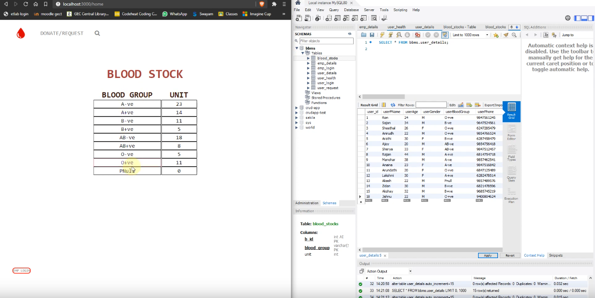

# Blood Bank App

A simple web application for managing a blood bank. The app provides functionalities that make it easy for the management of a blood bank.



## Technologies Used

The application was built using the following technologies:

- **ReactJS** (Frontend)
- **JavaScript**
- **Node.js** (Backend)
- **MySQL** (Database)

## Features

The app incorporates the following features for two categories of users:

### User
- Register & Login
- Donate blood
- Request blood

### Employee
- Register & Login
- Update blood stocks
- Update user health
- Handle blood requests

### General
- Search based on blood group or location

<!-- ## Deployment

Click [here](https://lonebots.github.io/blood-bank-app/) for the live demo (Note: Some functionalities may be unavailable since it's statically hosted).  
Watch the detailed explanation about the app [here](https://youtu.be/LRvpY_4qsOk). -->

## Screenshots

### Blood Bank Schema
<p align="center">
    
    
</p>

## Run Locally

To run the project locally:

### 1. Clone the Project
```bash
git clone https://github.com/babitamedhi/blood_bank_app.git
